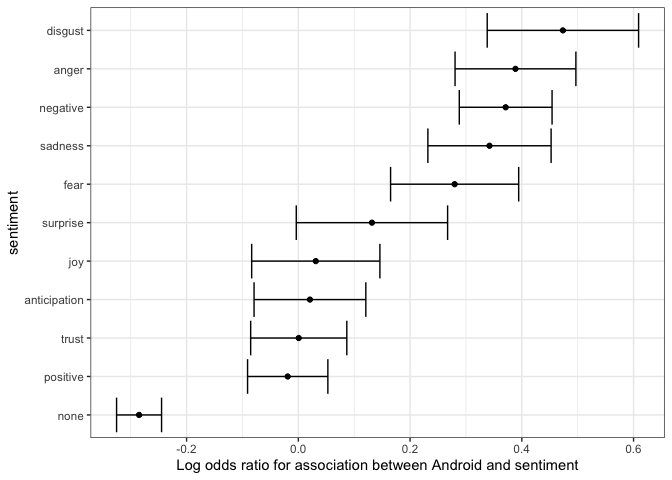
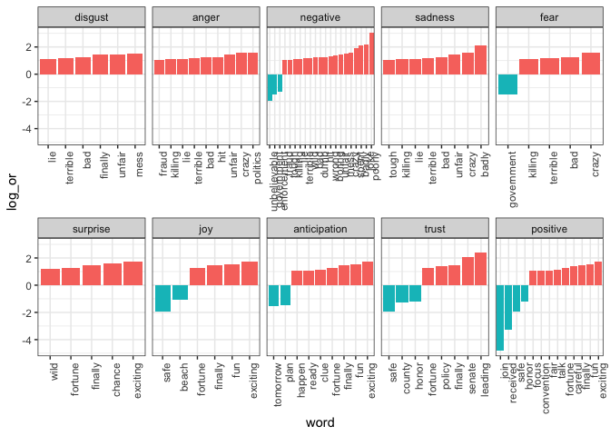

Sentiment Analysis on Twitter Data
================
Vasu Goel

2019-7-30

-----

## Text mining

In many applications, data starts as text. Well known examples are spam
filtering, cyber-crime prevention, counter-terrorism and sentiment
analysis. In all these cases, the raw data is composed of free form
text. Our task is to extract insights from these data. We generate
useful numerical summaries from text data to which we can apply some of
the powerful data visualization and analysis techniques.

### <u>1. Case study: Trump tweets</u>

During the 2016 US presidential election, then candidate Donald J. Trump
used his twitter account as a way to communicate with potential voters.
On August 6, 2016, Todd Vaziri tweeted\[1\] about Trump that “Every
non-hyperbolic tweet is from iPhone (his staff). Every hyperbolic tweet
is from Android (from him).” Data scientist David Robinson conducted an
analysis\[2\] to determine if data supported this assertion. I tried to
recreate David’s analysis by performing text mining procedures using R
programming language.

We use the following libraries:

``` r
library(tidyverse)
library(lubridate)
library(scales)
library(dslabs)
```

In general, we can extract data directly from Twitter using the
**rtweet** package. However, in this case, a group has already compiled
data for us and made it available at
<http://www.trumptwitterarchive.com>. We can get the data from their
JSON API using a script like this:

``` r
url <- 'http://www.trumptwitterarchive.com/data/realdonaldtrump/%s.json'
trump_tweets <- map(2009:2017, ~sprintf(url, .x)) %>%
  map_df(jsonlite::fromJSON, simplifyDataFrame = TRUE) %>%
  filter(!is_retweet & !str_detect(text, '^"')) %>%
  mutate(created_at = parse_date_time(created_at, 
                                      orders = "a b! d! H!:M!:S! z!* Y!",
                                      tz="EST")) 
```

You can see the data frame with information about the tweets by typing

``` r
head(trump_tweets)
```

with the following variables included:

``` r
names(trump_tweets)
## [1] "source"                  "id_str"                 
## [3] "text"                    "created_at"             
## [5] "retweet_count"           "in_reply_to_user_id_str"
## [7] "favorite_count"          "is_retweet"
```

The tweets are represented by the text variable:

``` r
trump_tweets$text[16413] %>% str_wrap(width = options()$width) %>% cat
## Great to be back in Iowa! #TBT with @JerryJrFalwell joining me in
## Davenport- this past winter. #MAGA https://t.co/A5IF0QHnic
```

and the source variable tells us which device was used to compose and
upload each tweet:

``` r
trump_tweets %>% count(source) %>% arrange(desc(n)) %>% head(5)
## # A tibble: 5 x 2
##   source                  n
##   <chr>               <int>
## 1 Twitter Web Client  10718
## 2 Twitter for Android  4652
## 3 Twitter for iPhone   3962
## 4 TweetDeck             468
## 5 TwitLonger Beta       288
```

We are interested in what happened during the campaign, so for this
analysis we will focus on what was tweeted between the day Trump
announced his campaign and election day. We define the following table
containing just the tweets from that time period. Note that we use
`extract` to remove the `Twitter for` part of the source and filter out
retweets.

``` r
campaign_tweets <- trump_tweets %>% 
  extract(source, "source", "Twitter for (.*)") %>%
  filter(source %in% c("Android", "iPhone") &
           created_at >= ymd("2015-06-17") & 
           created_at < ymd("2016-11-08")) %>%
  filter(!is_retweet) %>%
  arrange(created_at)
```

We can now use data visualization to explore the possibility that two
different groups were tweeting from these devices. For each tweet, we
will extract the hour, East Coast time (EST), it was tweeted and then
compute the proportion of tweets tweeted at each hour for each device:

``` r
ds_theme_set()
campaign_tweets %>%
  mutate(hour = hour(with_tz(created_at, "EST"))) %>%
  count(source, hour) %>%
  group_by(source) %>%
  mutate(percent = n / sum(n)) %>%
  ungroup %>%
  ggplot(aes(hour, percent, color = source)) +
  geom_line() +
  geom_point() +
  scale_y_continuous(labels = percent_format()) +
  labs(x = "Hour of day (EST)", y = "% of tweets", color = "")
```


We notice a big peak for the Android in the early hours of the morning,
between 6 and 8 AM. There seems to be a clear difference in these
patterns. We will therefore assume that two different entities are using
these two devices.

We will now study how the tweets differ when we compare Android to
iPhone. To do this, we introduce the **tidytext** package.

### <u>2. Text as data</u>

The **tidytext** package helps us convert free form text into a tidy
table. Having the data in this format greatly facilitates data
visualization and the use of statistical techniques.

``` r
library(tidytext)
```

The main function needed to achieve this is `unnest_tokens`. A *token*
refers to a unit that we are considering to be a data point. The most
common *token* will be words, but they can also be single characters,
ngrams, sentences, lines, or a pattern defined by a regex. The functions
will take a vector of strings and extract the tokens so that each one
gets a row in the new table. Let’s look at an example from the tweets:

``` r
i <- 3008
campaign_tweets$text[i] %>% str_wrap(width = 65) %>% cat()
## Great to be back in Iowa! #TBT with @JerryJrFalwell joining me in
## Davenport- this past winter. #MAGA https://t.co/A5IF0QHnic
campaign_tweets[i,] %>% 
  unnest_tokens(word, text) %>%
  pull(word) 
##  [1] "great"          "to"             "be"             "back"          
##  [5] "in"             "iowa"           "tbt"            "with"          
##  [9] "jerryjrfalwell" "joining"        "me"             "in"            
## [13] "davenport"      "this"           "past"           "winter"        
## [17] "maga"           "https"          "t.co"           "a5if0qhnic"
```

Note that the function tries to convert tokens into words. To do this,
however, it strips characters that are important in the context of
twitter. Namely, the function removes all the `#` and `@`. A *token* in
the context of Twitter is not the same as in the context of spoken or
written English. For this reason, instead of using the default, words,
we define a regex that captures Twitter characters. We are defining a
pattern that starts with @, \# or neither, and is followed by any
combination of letters or digits:

``` r
pattern <- "([^A-Za-z\\d#@']|'(?![A-Za-z\\d#@]))"
```

We can now use the `unnest_tokens` function with the `regex` option and
appropriately extract the hashtags and mentions. We demonstrate with our
example tweet:

``` r
campaign_tweets[i,] %>% 
  unnest_tokens(word, text, token = "regex", pattern = pattern) %>%
  pull(word)
##  [1] "great"           "to"              "be"             
##  [4] "back"            "in"              "iowa"           
##  [7] "#tbt"            "with"            "@jerryjrfalwell"
## [10] "joining"         "me"              "in"             
## [13] "davenport"       "this"            "past"           
## [16] "winter"          "#maga"           "https"          
## [19] "t"               "co"              "a5if0qhnic"
```

Another minor adjustment we want to make is to remove the links to
pictures:

``` r
links <- "https://t.co/[A-Za-z\\d]+|&amp;"
campaign_tweets[i,] %>% 
  mutate(text = str_replace_all(text, links, ""))  %>%
  unnest_tokens(word, text, token = "tweets") %>%
  pull(word)
##  [1] "great"           "to"              "be"             
##  [4] "back"            "in"              "iowa"           
##  [7] "#tbt"            "with"            "@jerryjrfalwell"
## [10] "joining"         "me"              "in"             
## [13] "davenport"       "this"            "past"           
## [16] "winter"          "#maga"
```

Now we are now ready to extract the words for all our tweets:

``` r
tweet_words <- campaign_tweets %>% 
  mutate(text = str_replace_all(text, links, ""))  %>%
  unnest_tokens(word, text, token = "tweets") 
```

And we can now answer questions such as “what are the most commonly used
words?”:

``` r
tweet_words %>% 
  count(word) %>%
  arrange(desc(n))
## # A tibble: 6,620 x 2
##    word      n
##    <chr> <int>
##  1 the    2329
##  2 to     1410
##  3 and    1239
##  4 in     1185
##  5 i      1143
##  6 a      1112
##  7 you     999
##  8 of      982
##  9 is      942
## 10 on      874
## # … with 6,610 more rows
```

It is not surprising that these are the top words. The top words are not
informative. The *tidytext* package has a database of these commonly
used words, referred to as *stop words*, in text mining:

``` r
stop_words
## # A tibble: 1,149 x 2
##    word        lexicon
##    <chr>       <chr>  
##  1 a           SMART  
##  2 a's         SMART  
##  3 able        SMART  
##  4 about       SMART  
##  5 above       SMART  
##  6 according   SMART  
##  7 accordingly SMART  
##  8 across      SMART  
##  9 actually    SMART  
## 10 after       SMART  
## # … with 1,139 more rows
```

If we filter out rows representing stop words with `filter(!word %in%
stop_words$word)`:

``` r
tweet_words <- campaign_tweets %>% 
  mutate(text = str_replace_all(text, links, ""))  %>%
  unnest_tokens(word, text, token = "tweets") %>%
  filter(!word %in% stop_words$word ) 
```

we end up with a much more informative set of top 10 tweeted words:

``` r
tweet_words %>% 
  count(word) %>%
  top_n(10, n) %>%
  mutate(word = reorder(word, n)) %>%
  arrange(desc(n))
## # A tibble: 10 x 2
##    word                       n
##    <fct>                  <int>
##  1 #trump2016               414
##  2 hillary                  405
##  3 people                   303
##  4 #makeamericagreatagain   294
##  5 america                  254
##  6 clinton                  237
##  7 poll                     217
##  8 crooked                  205
##  9 trump                    195
## 10 cruz                     159
```

Some exploration of the resulting words (not shown here) reveals a
couple of unwanted characteristics in our tokens. First, some of our
tokens are just numbers (years, for example). We want to remove these
and we can find them using the regex `^\d+$`. Second, some of our tokens
come from a quote and they start with `'`. We want to remove the `'`
when it is at the start of a word so we will just `str_replace`. We add
these two lines to the code above to generate our final table:

``` r
tweet_words <- campaign_tweets %>% 
  mutate(text = str_replace_all(text, links, ""))  %>%
  unnest_tokens(word, text, token = "tweets") %>%
  filter(!word %in% stop_words$word &
           !str_detect(word, "^\\d+$")) %>%
  mutate(word = str_replace(word, "^'", ""))
```

Now that we have all our words in a table, along with information about
what device was used to compose the tweet they came from, we can start
exploring which words are more common when comparing Android to iPhone.

For each word, we want to know if it is more likely to come from an
Android tweet or an iPhone tweet. For each device and a given word,
let’s call it `y`, we compute the odds or the ratio between the
proportion of words that are `y` and not `y` and compute the ratio of
those odds. Here we will have many proportions that are 0, so we use the
0.5 correction.

``` r
android_iphone_or <- tweet_words %>%
  count(word, source) %>%
  spread(source, n, fill = 0) %>%
  mutate(or = (Android + 0.5) / (sum(Android) - Android + 0.5) / 
           ( (iPhone + 0.5) / (sum(iPhone) - iPhone + 0.5)))
```

Here are the highest odds ratios for Android

``` r
android_iphone_or %>% arrange(desc(or))
## # A tibble: 5,914 x 4
##    word      Android iPhone    or
##    <chr>       <dbl>  <dbl> <dbl>
##  1 poor           13      0  23.1
##  2 poorly         12      0  21.4
##  3 turnberry      11      0  19.7
##  4 @cbsnews       10      0  18.0
##  5 angry          10      0  18.0
##  6 bosses         10      0  18.0
##  7 write          10      0  18.0
##  8 brexit          9      0  16.3
##  9 defend          9      0  16.3
## 10 funny           9      0  16.3
## # … with 5,904 more rows
```

and the top for iPhone:

``` r
android_iphone_or %>% arrange(or)
## # A tibble: 5,914 x 4
##    word                   Android iPhone      or
##    <chr>                    <dbl>  <dbl>   <dbl>
##  1 #makeamericagreatagain       0    294 0.00142
##  2 #americafirst                0     71 0.00595
##  3 #draintheswamp               0     63 0.00670
##  4 #trump2016                   3    411 0.00706
##  5 #votetrump                   0     56 0.00753
##  6 join                         1    157 0.00805
##  7 #imwithyou                   0     51 0.00827
##  8 #crookedhillary              0     30 0.0140 
##  9 #fitn                        0     30 0.0140 
## 10 #gopdebate                   0     30 0.0140 
## # … with 5,904 more rows
```

Given that several of these words are overall low frequency words, we
can impose a filter based on the total frequency like this:

``` r
android_iphone_or %>% filter(Android+iPhone > 100) %>%
  arrange(desc(or))
## # A tibble: 30 x 4
##    word        Android iPhone    or
##    <chr>         <dbl>  <dbl> <dbl>
##  1 @cnn             90     17  4.44
##  2 bad             104     26  3.39
##  3 crooked         156     49  2.72
##  4 interviewed      76     25  2.57
##  5 media            76     25  2.57
##  6 ted              84     28  2.54
##  7 win              74     28  2.24
##  8 hillary         289    116  2.14
##  9 debate           79     32  2.10
## 10 cruz            113     46  2.09
## # … with 20 more rows
android_iphone_or %>% filter(Android+iPhone > 100) %>%
  arrange(or)
## # A tibble: 30 x 4
##    word                   Android iPhone      or
##    <chr>                    <dbl>  <dbl>   <dbl>
##  1 #makeamericagreatagain       0    294 0.00142
##  2 #trump2016                   3    411 0.00706
##  3 join                         1    157 0.00805
##  4 tomorrow                    24     99 0.209  
##  5 vote                        46     67 0.588  
##  6 america                    114    140 0.695  
##  7 tonight                     70     84 0.712  
##  8 iowa                        61     65 0.802  
##  9 trump                      104     91 0.976  
## 10 poll                       116    101 0.981  
## # … with 20 more rows
```

We already see somewhat of a pattern in the types of words that are
being tweeted more from one device versus the other. However, we are not
interested in specific words but rather in the tone. Vaziri’s assertion
is that the Android tweets are more hyperbolic. So how can we check this
with data? *Hyperbolic* is a hard sentiment to extract from words as it
relies on interpreting phrases. However, words can be associated to more
basic sentiment such as anger, fear, joy, and surprise. In the next
section, we demonstrate basic sentiment analysis.

### <u>3. Sentiment Analysis</u>

In sentiment analysis, we assign a word to one or more “sentiments”.
Although this approach will miss context dependent sentiments, such as
sarcasm, when performed on large numbers of words, summaries can provide
insights.

The **tidytext** package includes several maps or lexicons. We will also
be using the **textdata** package:

``` r
library(tidytext)
library(textdata)
```

The first step in sentiment analysis is to assign a sentiment to each
word. The **tidytext** package includes several maps or lexicons in the
object `sentiments`.

The `bing` lexicon divides words into `positive` and `negative`
sentiments. We can see this using the *tidytext* function
`get_sentiments`:

``` r
get_sentiments("bing")
```

The `AFINN` lexicon assigns a score between -5 and 5, with -5 the most
negative and 5 the most positive. Note that this lexicon needs to be
downloaded the first time you call the function `get_sentiment`:

``` r
get_sentiments("afinn")
```

The `loughran` and `nrc` lexicons provide several different sentiments.
Note that these also have to be downloaded the first time you use them.

``` r
get_sentiments("loughran") %>% count(sentiment)
## # A tibble: 6 x 2
##   sentiment        n
##   <chr>        <int>
## 1 constraining   184
## 2 litigious      904
## 3 negative      2355
## 4 positive       354
## 5 superfluous     56
## 6 uncertainty    297
```

``` r
get_sentiments("nrc") %>% count(sentiment)
## # A tibble: 10 x 2
##    sentiment        n
##    <chr>        <int>
##  1 anger         1247
##  2 anticipation   839
##  3 disgust       1058
##  4 fear          1476
##  5 joy            689
##  6 negative      3324
##  7 positive      2312
##  8 sadness       1191
##  9 surprise       534
## 10 trust         1231
```

For our analysis, we are interested in exploring the different
sentiments of each tweet so we will use the `nrc` lexicon:

``` r
nrc <- get_sentiments("nrc") %>%
  select(word, sentiment)
```

We can combine the words and sentiments using `inner_join`, which will
only keep words associated with a sentiment. Here are 10 random words
extracted from the tweets:

``` r
tweet_words %>% inner_join(nrc, by = "word") %>% 
  select(source, word, sentiment) %>% 
  sample_n(5)
```

    ##    source     word    sentiment
    ## 1  iPhone  failing         fear
    ## 2 Android    proud        trust
    ## 3 Android     time anticipation
    ## 4  iPhone horrible      disgust
    ## 5 Android  failing        anger

Now we are ready to perform a quantitative analysis comparing Android
and iPhone by comparing the sentiments of the tweets posted from each
device. Here we could perform a tweet by tweet analysis, assigning a
sentiment to each tweet. However, this will be challenging since each
tweet will have several sentiments attached to it, one for each word
appearing in the lexicon. For illustrative purposes, we will perform a
much simpler analysis: we will count and compare the frequencies of each
sentiment appearing in each device.

``` r
sentiment_counts <- tweet_words %>%
  left_join(nrc, by = "word") %>%
  count(source, sentiment) %>%
  spread(source, n) %>%
  mutate(sentiment = replace_na(sentiment, replace = "none"))
sentiment_counts
## # A tibble: 11 x 3
##    sentiment    Android iPhone
##    <chr>          <int>  <int>
##  1 anger            958    528
##  2 anticipation     910    715
##  3 disgust          638    322
##  4 fear             795    486
##  5 joy              688    535
##  6 negative        1641    929
##  7 positive        1806   1473
##  8 sadness          894    515
##  9 surprise         518    365
## 10 trust           1236    990
## 11 none           11904  10766
```

For each sentiment, we can compute the odds of being in the device:
proportion of words with sentiment versus proportion of words without,
and then compute the odds ratio comparing the two devices.

``` r
sentiment_counts %>%
  mutate(Android = Android / (sum(Android) - Android) , 
         iPhone = iPhone / (sum(iPhone) - iPhone), 
         or = Android/iPhone) %>%
  arrange(desc(or))
## # A tibble: 11 x 4
##    sentiment    Android iPhone    or
##    <chr>          <dbl>  <dbl> <dbl>
##  1 disgust       0.0299 0.0186 1.61 
##  2 anger         0.0456 0.0309 1.47 
##  3 negative      0.0807 0.0556 1.45 
##  4 sadness       0.0424 0.0301 1.41 
##  5 fear          0.0375 0.0284 1.32 
##  6 surprise      0.0241 0.0211 1.14 
##  7 joy           0.0323 0.0313 1.03 
##  8 anticipation  0.0432 0.0423 1.02 
##  9 trust         0.0596 0.0595 1.00 
## 10 positive      0.0895 0.0912 0.981
## 11 none          1.18   1.57   0.752
```

So we do see some differences and the order is interesting: the largest
three sentiments are disgust, anger, and negative\! But are these
differences just due to chance? How does this compare if we are just
assigning sentiments at random? To answer this question we can compute,
for each sentiment, an odds ratio and a confidence interval. We will add
the two values we need to form a two-by-two table and the odds ratio:

``` r
library(broom)
log_or <- sentiment_counts %>%
  mutate(log_or = log((Android / (sum(Android) - Android)) / 
      (iPhone / (sum(iPhone) - iPhone))),
          se = sqrt(1/Android + 1/(sum(Android) - Android) + 
                      1/iPhone + 1/(sum(iPhone) - iPhone)),
          conf.low = log_or - qnorm(0.975)*se,
          conf.high = log_or + qnorm(0.975)*se) %>%
  arrange(desc(log_or))
  
log_or
```

    ## # A tibble: 11 x 7
    ##    sentiment    Android iPhone    log_or     se conf.low conf.high
    ##    <chr>          <int>  <int>     <dbl>  <dbl>    <dbl>     <dbl>
    ##  1 disgust          638    322  0.474    0.0691  0.338      0.609 
    ##  2 anger            958    528  0.389    0.0552  0.281      0.497 
    ##  3 negative        1641    929  0.371    0.0424  0.288      0.454 
    ##  4 sadness          894    515  0.342    0.0563  0.232      0.452 
    ##  5 fear             795    486  0.280    0.0585  0.165      0.394 
    ##  6 surprise         518    365  0.132    0.0691 -0.00368    0.267 
    ##  7 joy              688    535  0.0312   0.0586 -0.0835     0.146 
    ##  8 anticipation     910    715  0.0208   0.0510 -0.0792     0.121 
    ##  9 trust           1236    990  0.000737 0.0439 -0.0853     0.0868
    ## 10 positive        1806   1473 -0.0190   0.0367 -0.0909     0.0529
    ## 11 none           11904  10766 -0.285    0.0205 -0.325     -0.245

A graphical visualization shows some sentiments that are clearly
overrepresented:

``` r
log_or %>%
  mutate(sentiment = reorder(sentiment, log_or)) %>%
  ggplot(aes(x = sentiment, ymin = conf.low, ymax = conf.high)) +
  geom_errorbar() +
  geom_point(aes(sentiment, log_or)) +
  ylab("Log odds ratio for association between Android and sentiment") +
  coord_flip() 
```



We see that the disgust, anger, negative, sadness and fear sentiments
are associated with the Android in a way that is hard to explain by
chance alone. Words not associated to a sentiment were strongly
associated with the iPhone source, which is in agreement with the
original claim about hyperbolic tweets.

If we are interested in exploring which specific words are driving these
differences, we can refer back to our `android_iphone_or` object:

``` r
android_iphone_or %>% inner_join(nrc) %>%
  filter(sentiment == "disgust" & Android + iPhone > 10) %>%
  arrange(desc(or))
## Joining, by = "word"
## # A tibble: 20 x 5
##    word      Android iPhone    or sentiment
##    <chr>       <dbl>  <dbl> <dbl> <chr>    
##  1 mess           13      2 4.62  disgust  
##  2 finally        12      2 4.28  disgust  
##  3 unfair         12      2 4.28  disgust  
##  4 bad           104     26 3.39  disgust  
##  5 terrible       31      8 3.17  disgust  
##  6 lie            12      3 3.05  disgust  
##  7 lying           9      3 2.32  disgust  
##  8 waste          12      5 1.94  disgust  
##  9 illegal        32     14 1.92  disgust  
## 10 phony          20      9 1.85  disgust  
## 11 pathetic       11      5 1.79  disgust  
## 12 nasty          13      6 1.78  disgust  
## 13 horrible       14      7 1.65  disgust  
## 14 disaster       21     11 1.60  disgust  
## 15 winning        14      9 1.31  disgust  
## 16 liar            6      5 1.01  disgust  
## 17 john           24     21 0.974 disgust  
## 18 dishonest      36     32 0.960 disgust  
## 19 dying           6      6 0.855 disgust  
## 20 terrorism       9      9 0.855 disgust
```

and we can make a graph:

``` r
android_iphone_or %>% inner_join(nrc, by = "word") %>%
  mutate(sentiment = factor(sentiment, levels = log_or$sentiment)) %>%
  mutate(log_or = log(or)) %>%
  filter(Android + iPhone > 10 & abs(log_or)>1) %>%
  mutate(word = reorder(word, log_or)) %>%
  ggplot(aes(word, log_or, fill = log_or < 0)) +
  facet_wrap(~sentiment, scales = "free_x", nrow = 2) + 
  geom_bar(stat="identity", show.legend = FALSE) +
  theme(axis.text.x = element_text(angle = 90, hjust = 1)) 
```



This analysis solidifies the assertion made by **Todd Vaziri** about
President Trump that, “Every non-hyperbolic tweet is from iPhone (his
staff). Every hyperbolic tweet is from Android (from him).”

1.  <https://twitter.com/tvaziri/status/762005541388378112/photo/1>

2.  <http://varianceexplained.org/r/trump-tweets/>
